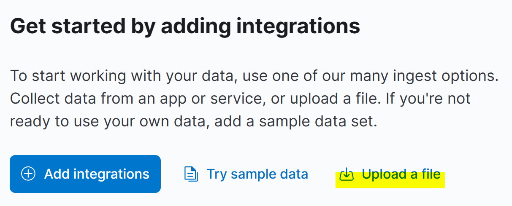
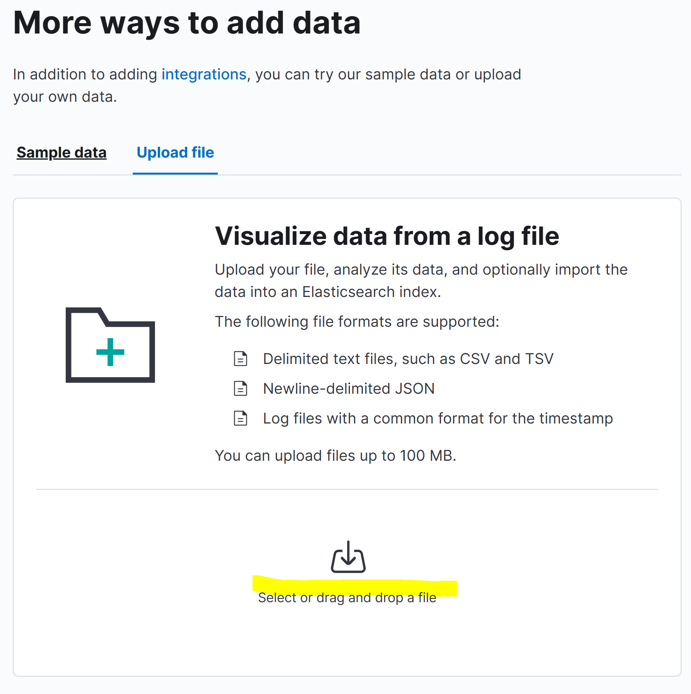
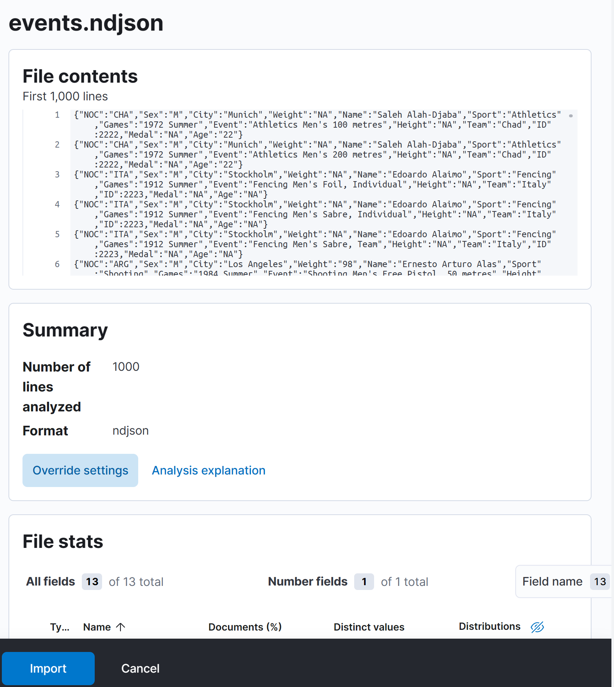
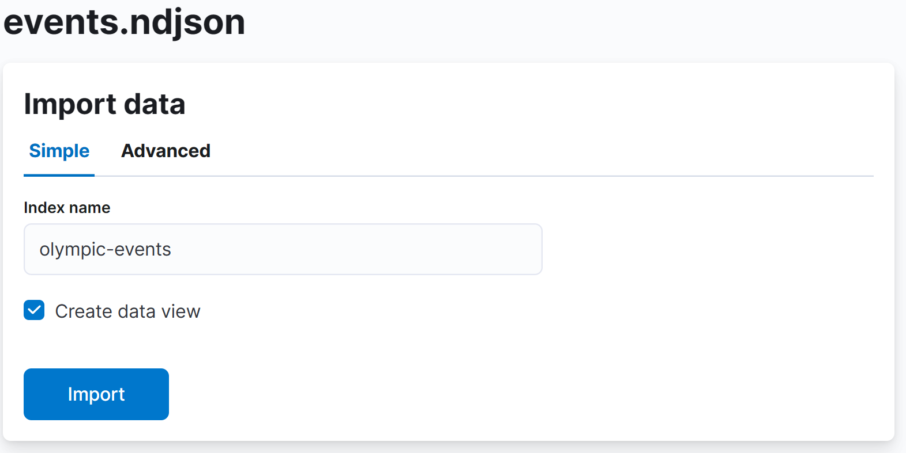

= Exercises 1

== Exercise 01
Configure Elasticsearch with the following criteria and start Elasticsearch:

다음 기준으로 Elasticsearch를 구성하고 Elasticsearch를 시작하십시오.

[cols="3,7",options=header]
|===
|Property
|Value

|Cluster name
|lab-cluster

|Node name
|node01

|Heap size
|2g

|===

=== Solution
1. 터미널의 검정 환경에서 `vagrant ssh node1` 으로 접속

2. `vi elasticsearch-8.1.3/config/elasticsearch.yml` 입력 후 다음과 같이 수정

[source,yaml]
----
#cluster.name: elastic-lab
cluster.name: lab-cluster

#node.name: ${HOSTNAME}
node.name: node01

network.host: _eth1_

discovery.seed_hosts: ["node1", "node2", "node3"]

#기존 node1을 node01로 수정
#cluster.initial_master_nodes: ["node01"]
cluster.initial_master_nodes: ["node01"]

# v8 부터 사용하지 않아도 보안속성이 명시되어 있어야 함.
xpack.security.enabled: false
----

[start=3]
3. `vi elasticsearch-8.1.3/config/jvm.options` 입력 후 22 line을 다음과 같이 수정

[source,yaml]
----
#-Xms512m
#-Xmx512m
-Xms2g
-Xmx2g
----
[start=4]
4. `elasticsearch-8.1.3/bin/elasticsearch`로 Elasticsearch 실행

== Exercise 02
Configure Kibana to point to your Elasticsearch node and start Kibana.

Elasticsearch 노드를 가리키도록 Kibana를 구성하고 Kibana를 시작하세요.

=== Solution
1. 터미널의 검정 환경에서 `vagrant ssh node4` 으로 접속

2. `vi kibana-8.1.3/config/kibana.yml` 입력 후 다음과 같이 입력되어 있는지 확인
[source,yaml]
----
...
server.host: "10.0.200.104"
...
elasticsearch.hosts: ["http://10.0.200.101:9200"]
...
----
[start=3]
3. `kibana-8.1.3/bin/kibana`로 kibana 실행

== Exercise 03
Download the dataset link:./assets/events.ndjson[from here] and use Kibana's Data Visualizer to upload the file into a new index called `olympic-events`.

여기에서 데이터세트를 다운로드하고 Kibana의 Data Visualizer를 사용하여 `olympic-events`라는 새 인덱스에 파일을 업로드하세요.

=== Solution
1. "from here"를 클릭하여 events.ndjson 파일 다운로드

2. 메인 화면에서 "Upload a file" 클릭

[start=3]
3. "Upload file" 탭에서 "events.ndjson" 파일 업로드

[start=4]
4. 업로드된 파일이 잘 읽혀졌는지 확인하고 하단의 import 버튼 클릭

[start=5]
5. 인덱스 명을 "olympic-events"로 하여 생성

== Exercise 04
Validate that the data was imported correctly by using a single API call to show the index name, index health, number of documents, and the size of the primary store. The details in the response must be in that order, with headers, and for the new index only.

인덱스 이름, 인덱스 상태, 문서 수 및 기본 저장소 크기를 표시하는 단일 API 호출을 사용하여 데이터를 올바르게 가져왔는지 확인합니다. 응답의 세부정보는 헤더를 포함하여 새 인덱스에 대해서만 해당 순서로 이루어져야 합니다.

=== Solution
1. dev tools에서 다음을 입력

[source,json]
----
GET _cat/indices/olympic-events/?v&h=index,health,docs.count,pri.store.size
----

[start=2]
2. 아래와 같이 결과가 나오는지 확인

[source]
----
index          health docs.count pri.store.size
olympic-events yellow     271116         32.4mb
----

== Exercise 05
The cluster health is yellow. Use a cluster API that can explain the problem.

클러스터 상태는 노란색입니다. 문제를 설명할 수 있는 클러스터 API를 사용하세요.

=== Solution
1. dev tools에서 다음 API(link:https://www.elastic.co/guide/en/elasticsearch/reference/current/cluster-allocation-explain.html[Cluster allocation explain API])을 입력

[source,json]
----
GET _cluster/allocation/explain
----

[start=2]
2. 결과 확인

[source]
----
{
  ...
  "index" : "olympic-events",
  "shard" : 0,
  "primary" : false,
  "current_state" : "unassigned",
  ...
  "can_allocate" : "no",
  "allocate_explanation" : "cannot allocate because allocation is not permitted to any of the nodes",
  ...
----

== Exercise 06
Change the cluster or index settings as required to get the cluster to a green status.

필요에 따라 클러스터 또는 인덱스 설정을 변경하여 클러스터를 녹색 상태로 만드세요.

=== Solution
1. 현재 노드가 1개라 복사본이 생성되지 않아 발생한 문제로, 복사본 생성이 안되도록 0으로 설정하여 해결

[source,json]
----
PUT olympic-events/_settings
{
  "number_of_replicas": 0
}
----

[start=2]
2. 인덱스 상태를 확인

[source,json]
----
GET _cat/indices/olympic-events/?v&h=index,health,docs.count,pri.store.size
----
[source]
----
#결과
index          health docs.count pri.store.size
olympic-events green      271116         32.4mb
----

== Exercise 07
Look at how Elasticsearch has applied very general-purpose mappings to the data. Why has it chosen to use a keyword type for the Age field? Find all unique values for the Age field; there are less than 100 unique values for the Age field. Look for any suspicious values.

Elasticsearch가 데이터에 매우 범용적인(general-purpose) 매핑을 어떻게 적용했는지 살펴보세요. Age 필드에 keyword type을 사용하기로 선택한 이유는 무엇입니까? Age 필드의 고유한 값을 모두 찾습니다. Age 필드의 고유 값이 100개 미만입니다. 의심스러운 값이 있는지 찾아보세요.

=== Solution
1. Dev tools에서 다음을 입력

[source,json]
----
GET olympic-events/_search
{
  "size": 0,
  "aggs": {
    "NAME": {
      "terms": {
        "field": "Age",
        "size": 100
      }
    }
  }
}
----

[start=2]
2. 결과를 보면 "NA"값들이 있고, 이로 인해 dynamic mapping시 keyword로 입력됨.

[source,json]
----
{
  "took" : 13,
  "timed_out" : false,
  "_shards" : {
    "total" : 1,
    "successful" : 1,
    "skipped" : 0,
    "failed" : 0
  },
  "hits" : {
    "total" : {
      "value" : 10000,
      "relation" : "gte"
    },
    "max_score" : null,
    "hits" : [ ]
  },
  "aggregations" : {
    "NAME" : {
      "doc_count_error_upper_bound" : 0,
      "sum_other_doc_count" : 0,
      "buckets" : [
        ...
        {
          "key" : "NA",
          "doc_count" : 9474
        },
        ...
      ]
    }
  }
}
----

== Exercise 08
We will be deleting data in the next exercise; making a backup is always prudent. Without making any changes to the data, reindex the olympic-events index into a new index called olympic-events-backup.

다음 연습에서는 데이터를 삭제하겠습니다. 백업을 만드는 것은 항상 신중합니다. 데이터를 변경하지 않고 olympic-events 인덱스를 olympic-events-backup이라는 새 인덱스로 다시 인덱싱합니다.

=== Solution
1. Dev tools에서 다음을 입력

[source,json]
----
POST _reindex
{
  "source": {
    "index": "olympic-events"
  },
  "dest": {
    "index": "olympic-events-backup"
  }
}
----

2. 다음 쿼리도 잘 생성되었는지 확인한다.
[source]
----
GET _cat/indices/olympic-events*/?v&h=index,health,docs.count,pri.store.size
----

[source]
----
index                 health docs.count pri.store.size
olympic-events-backup yellow     271116         40.8mb
olympic-events        green      271116         32.4mb
----

== Exercise 09
The Height and Weight fields suffer from the same problem as the Age field. Later exercises will require numeric-type queries for these fields so we want to exclude any document we can’t use in our analyses. In a single request, delete all documents from the `olympic-events` index that have a value of NA for either the Age, Height or Weight field.

Height 및 Weight 필드에는 Age 필드와 동일한 문제가 있습니다. 이후 연습에서는 이러한 필드에 대해 숫자 유형 쿼리가 필요하므로 분석에 사용할 수 없는 문서를 제외하려고 합니다. 단일 요청으로 Age, Height 또는 Weight 필드 값이 NA인 `olympic-events` 인덱스의 모든 문서를 삭제합니다.

=== Solution
[start=0]
0. (선택)삭제 쿼리에 맞춰 조건에 맞는지 부합하도록 검색 쿼리로 검증 할 수 있다.

[source]
----
GET olympic-events/_search
{
  "query": {
    "bool": {
      "should": [
        {
          "term": {
            "Age": {
              "value": "NA"
            }
          }
        },
        {
          "term": {
            "Age": {
              "value": "NA"
            }
          }
        },
        {
          "term": {
            "Age": {
              "value": "NA"
            }
          }
        }
      ],
      "minimum_should_match": 1
    }
  }
}
----

1. _delete_by_query를 통해 해당 doc들을 삭제한다.

[source]
----
POST olympic-events/_delete_by_query
{
  "query": {
    "bool": {
      "should": [
        {
          "term": {
            "Age": {
              "value": "NA"
            }
          }
        },
        {
          "term": {
            "Age": {
              "value": "NA"
            }
          }
        },
        {
          "term": {
            "Age": {
              "value": "NA"
            }
          }
        }
      ],
      "minimum_should_match": 1
    }
  }
}
----

== Exercise 10
Notice how the Games field contains both the Olympic year and season. Create an ingest pipeline called `split_games` that will split this field into two new fields - year and season - and remove the original Games field.

Games 필드에 어떻게 올림픽 연도와 시즌이 모두 포함되어 있는지 확인하세요. 이 필드를 두 개의 새 필드(year 및 season)로 분할하고 원래 게임 필드를 제거하는 `split_games`이라는 수집 파이프라인을 만드세요.

=== Solution
1. 다음 쿼리로 올림픽 연도와 시즌 정보를 확인함

[source]
----
POST olympic-events/_search
{
  "_source": ["Games"]
}
----

[start=2]
2. split_games라는 인제스트 파이프라인 생성

[source]
----
PUT _ingest/pipeline/split_games
{
  "processors": [
    {
      "split": {
        "field": "Games",
        "separator": " "
      }
    },
    {
      "script": {
        "source": """
ctx.year = ctx.Games[0];
ctx.season = ctx.Games[1];
"""
      }
    },
    {
      "remove": {
        "field": "Games"
      }
    }
  ]
}
----

== Exercise 11
Ensure your new pipeline is working correctly by simulating it with these values:

다음 값으로 시뮬레이션하여 새 파이프라인이 올바르게 작동하는지 확인하세요.

`1998 Summer` +
`2014 Winter`

=== Solution
1. 다음 쿼리로 올림픽 연도와 시즌이 잘 나눠지는지 시뮬레이션 한다.

[source]
----
POST _ingest/pipeline/split_games/_simulate
{
  "docs": [
    {
      "_source": {
        "Games": "1998 Summer"
      }
    }
  ]
}

#결과
{
  "docs" : [
    {
      "doc" : {
        "_index" : "_index",
        "_id" : "_id",
        "_source" : {
          "season" : "Summer",
          "year" : "1998",
          "Games" : [
            "1998",
            "Summer"
          ]
        },
        "_ingest" : {
          "timestamp" : "2023-10-17T05:15:17.083347977Z"
        }
      }
    }
  ]
}
----

[source]
----
POST _ingest/pipeline/split_games/_simulate
{
  "docs": [
    {
      "_source": {
        "Games": "2014 Winter"
      }
    }
  ]
}

#결과
{
  "docs" : [
    {
      "doc" : {
        "_index" : "_index",
        "_id" : "_id",
        "_source" : {
          "season" : "Winter",
          "year" : "2014",
          "Games" : [
            "2014",
            "Winter"
          ]
        },
        "_ingest" : {
          "timestamp" : "2023-10-17T05:16:41.408249681Z"
        }
      }
    }
  ]
}
----

== Exercise 12
We'll now start to clean up the mappings. Create a new index called `olympic-events-fixed` with 1 shard, 0 replicas, and the following mapping:

이제 매핑 정리를 시작하겠습니다. 샤드 1개, 복제본 0개, 다음 매핑을 사용하여 `olympic-events-fixed`라는 새 인덱스를 생성합니다.

[cols="3,7",options=header]
|===
|Field
|Type

|athleteId
|integer

|age
|short

|height
|short

|weight
|short

|athleteName
|text + keyword

|gender
|keyword

|team
|keyword

|noc
|keyword

|year
|short

|season
|keyword

|city
|text + keyword

|sport
|keyword

|event
|text + keyword

|medal
|keyword

|===

=== Solution
[source]
----
PUT olympic-events-fixed
{
  "settings": {
    "number_of_shards": 1,
    "number_of_replicas": 0
  },
  "mappings": {
    "properties": {
      "athleteId": {
        "type": "integer"
      },
      "age": {
        "type": "short"
      },
      "height": {
        "type": "short"
      },
      "weight": {
        "type": "short"
      },
      "athleteName": {
        "type": "text",
        "fields": {
          "keyword": {
            "type": "keyword"
          }
        }
      },
      "gender": {
        "type": "keyword"
      },
      "team": {
        "type": "keyword"
      },
      "noc": {
        "type": "keyword"
      },
      "year": {
        "type": "short"
      },
      "season": {
        "type": "keyword"
      },
      "city": {
        "type": "text",
        "fields": {
          "keyword": {
            "type": "keyword"
          }
        }
      },
      "sport": {
        "type": "keyword"
      },
      "event": {
        "type": "text",
        "fields": {
          "keyword": {
            "type": "keyword"
          }
        }
      },
      "medal": {
        "type": "keyword"
      }
    }
  }
}
----